# Rapport d’activité

## 1er HACKATHON Thionville - Mercredi 28 mai 2025 - Puzzle Thionville

Le premier hackathon a rencontré un succès inattendu.

Cette collaboration entre Techtic&Co, le centre Le Lierre et Algorithmics se voulait être un coup d’essai.

Aussitôt ouvertes, les inscriptions ont dû être closes, tant les candidats étaient nombreux.

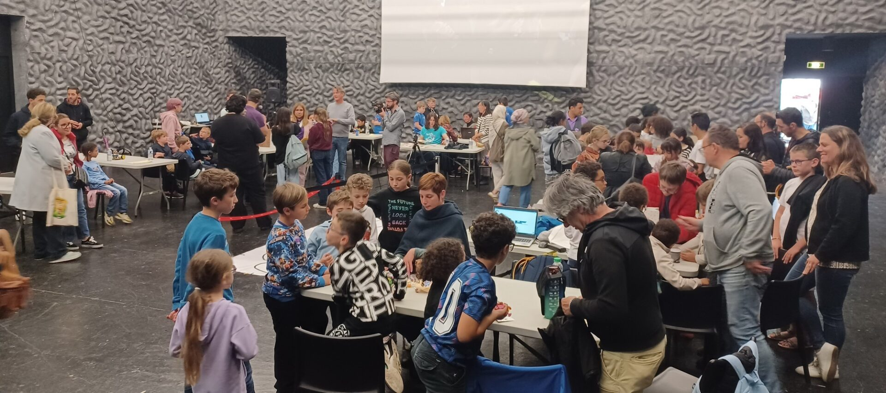
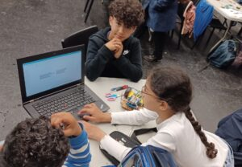
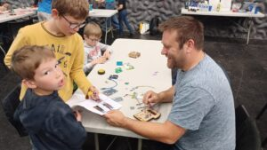
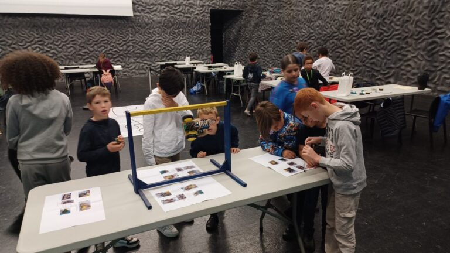
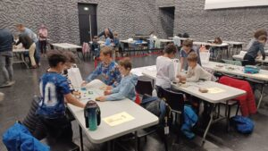

## TECHNOBOT - Vendredi 13 juin 2025 - Yutz

Comme chaque année, les collèges et lycées ont répondu présents.

Cette édition a été marquée par de très fortes chaleurs sous le toit du gymnase du collège Mermoz…

Néanmoins, toutes les présentations, démonstrations et duels se sont déroulés comme prévu.  

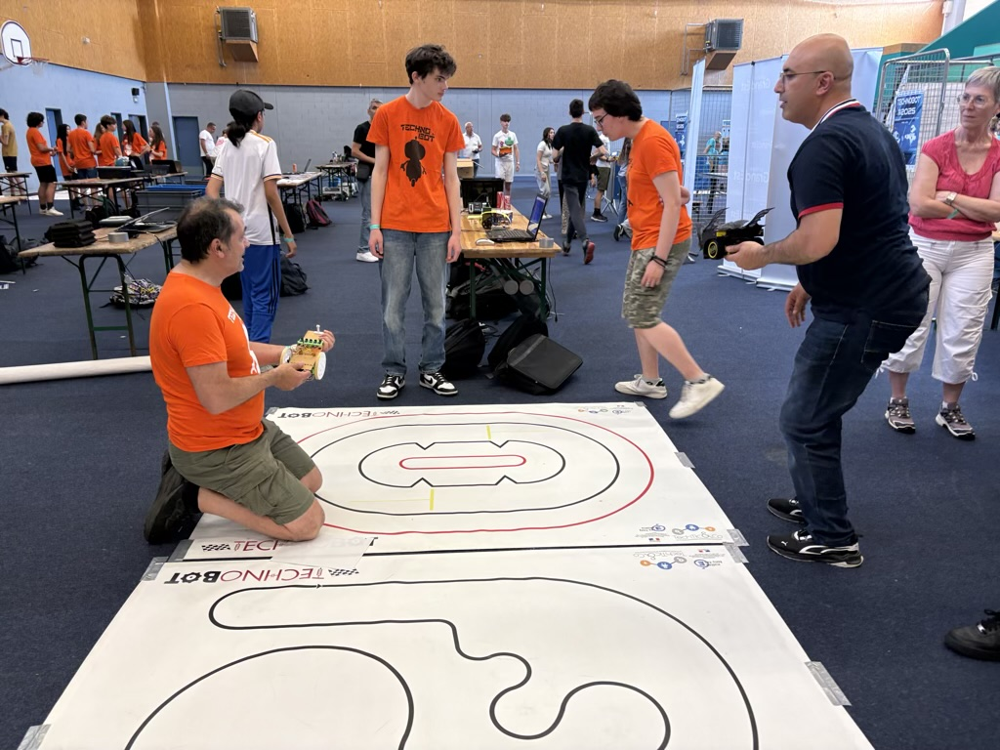
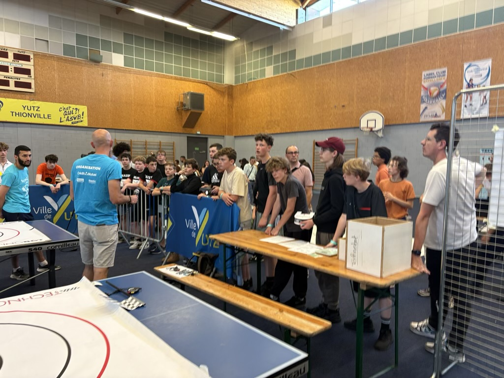
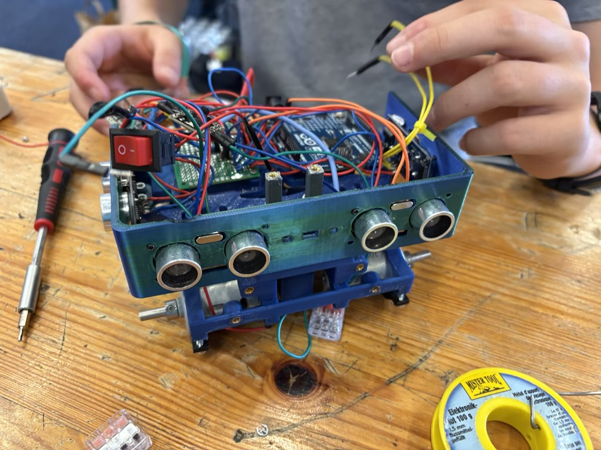

## La Thionvilloise - Dimanche 15 juin 2025 - Thionville

Marche/course organisée par Les Dames de Cœur, pour aider à la lutte contre le cancer.

Comme chaque année, Techtic&Co a animé un stand à destination des enfants.

Au programme de cette édition : manipulation de drones et démonstration de robots.  

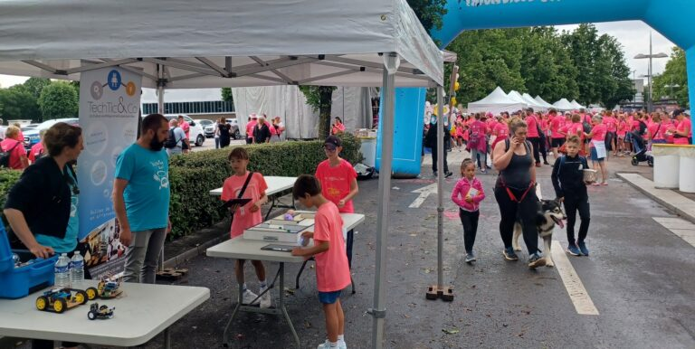
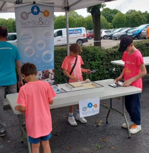

## Journée PÉRISCOLAIRE - Mercredi 7 mai 2025 – Thionville

Un groupe d’enfants de la Maison des Quartiers est venu découvrir les sciences au Thilab.  

Au menu : chimie et biologie.  

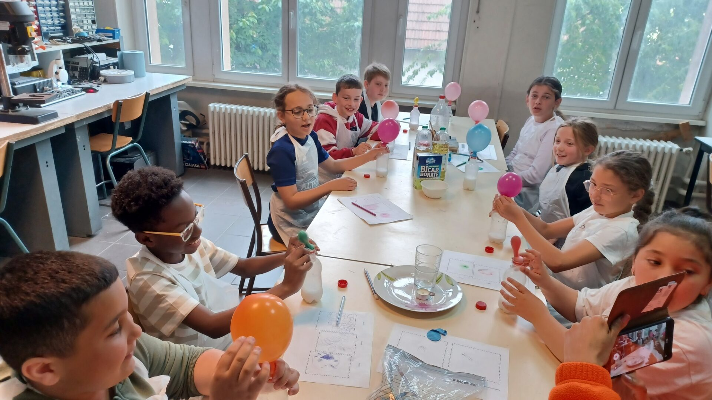

Les enfants ont pu réaliser quelques expériences ludiques et utiliser nos microscopes numériques.

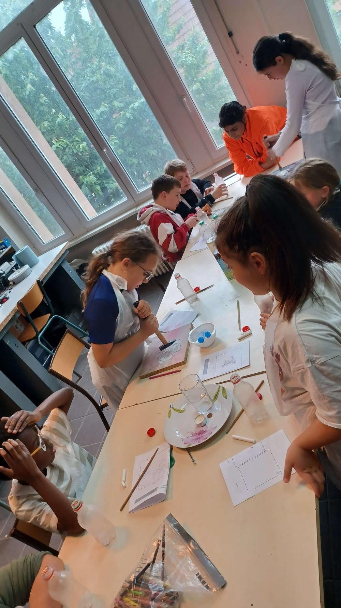
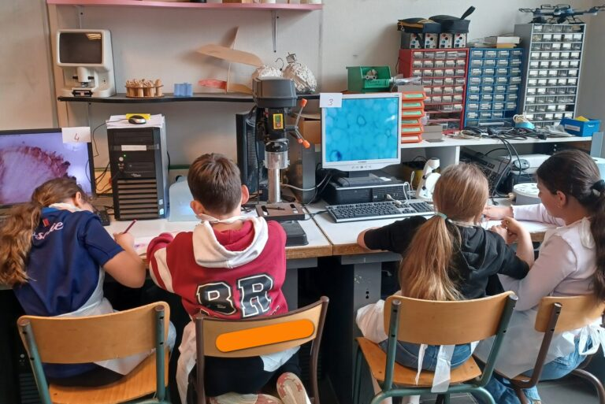

## Ateliers scientifiques - Mercredi 15h30 à 17h - Thionville

- 14 séances de sciences
  - Chimie, fabrication, électronique, robotique, biologie

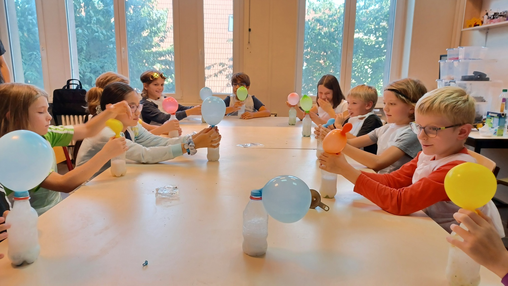
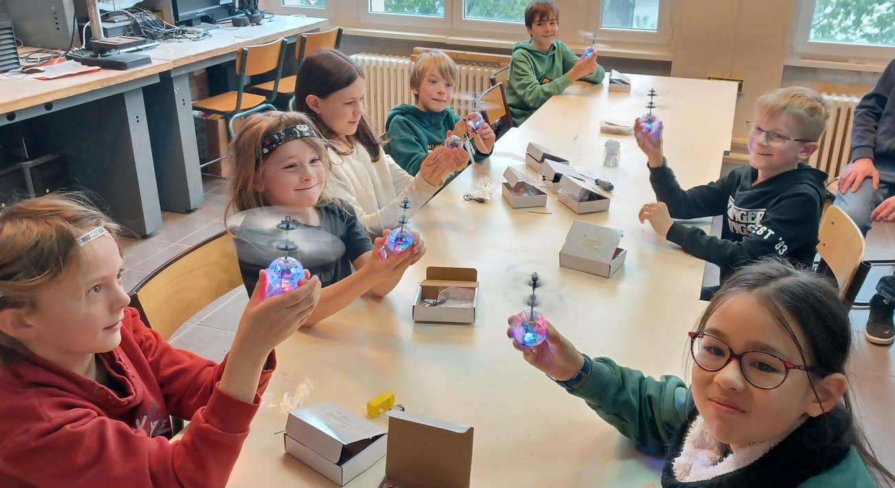
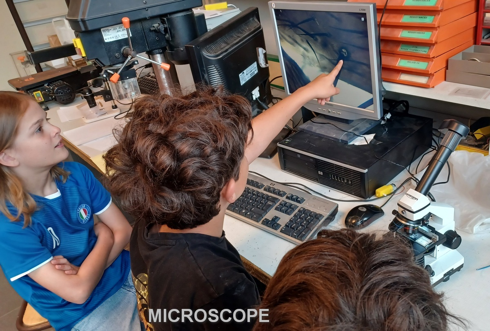

## Ateliers de robotique - Mercredi 14h à 15h30 - Thionville

Cet atelier est proposé par le Radioclub Scientifique de Thionville F8KGY et par Techtic&Co.  

Les enfants sont pris en charge alternativement par Techtic&Co et par F8KGY.  

- Techtic & Co
  - Débutants
    - Pilotage de drones Sphéro pour « se faire la main »
    - Assemblage puis programmation de robots Lego
    - Fabrication d’un robot suiveur de ligne, programmation sur Arduino
  - Initiés
    - Fabrication libre d’un robot, programmation

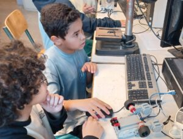
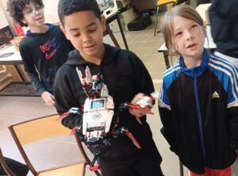
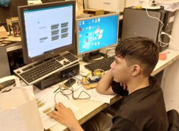
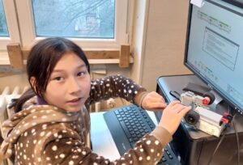
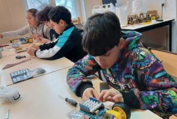
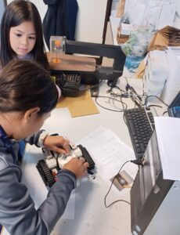

## THILAB

## FESTHI’SCIENCES